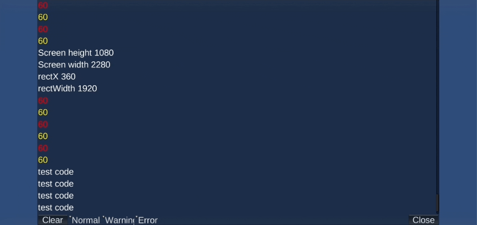

# simple-debug-console-unity

It's a very simple runtime log viewer using imgui. 
This is especially useful on mobile devices.

You can download also from [Unity Asset Store](https://assetstore.unity.com/packages/slug/228001)

## Features

- Resize to fit mobile device resolution
- Open with three-finger gesture(touch and drag)
- Log type filtering
- Portrait and Landscape support
- 16:9 9:16 fixed ratio

## Usage

Simply drop the scripts in your Unity3D Project and attach `SimpleDebugConsole` to a GameObject.

## Support

Please visit this repository's [Github issue tracker](https://github.com/coolishbee/simple-debug-console-unity/issues) for feature requests and bug reports related specifically to the Tool.

For other any questions, send us an email to chc3484@gmail.com